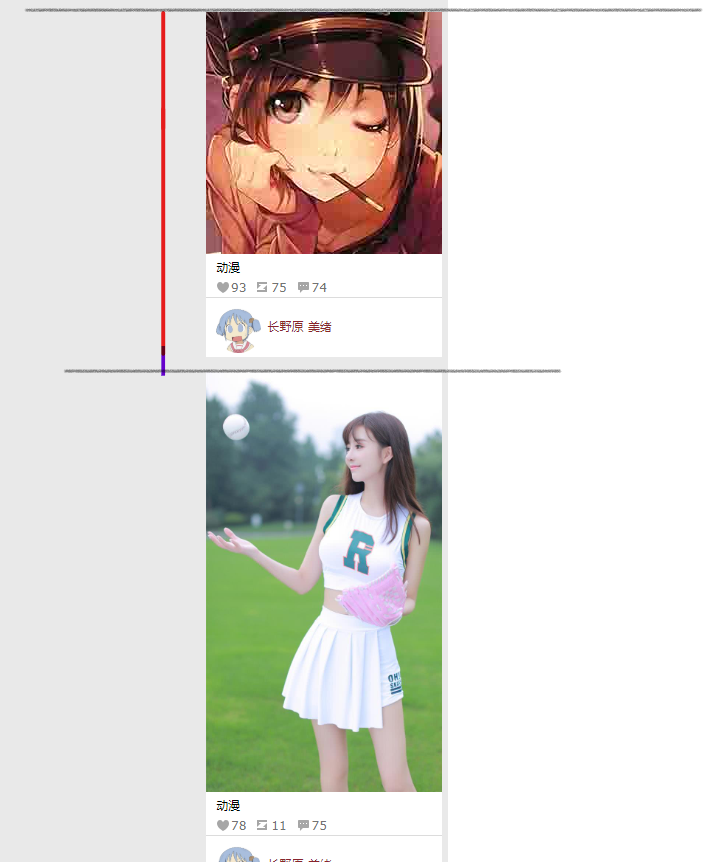

# 瀑布流
国内的网站里面，花瓣网是一个典型的瀑布流布局网站。
为了实现这个功能自己也做了一个demo来对一部分前端开发知识进行练习和总结。

---
## 目标
- 实现一个具备懒加载功能的瀑布流网页布局。
- 可以使用ajax实时加载图片并排序。
- 自适应网页。
## 难点：
- 每张图片根据不同的高度，摆放到何时的位置，保证网页不会出现空白和重叠。
- 需要根据页面位置判断是否自动生成dom并且添加到页面里。
- ……
---
### 创建变量和常量
在一切都考虑完善后开始创建基本的变量和常量。
```
 let randomNum = (x) => Math.round(Math.random() * x); //代码构建期为了模仿加载图片路径创建的一个随机整数函数。
 let arr = [];  //把每个随机生成的盒子的id标签保存在这里。
 let heightArr = [];  //把每一列的高度保存在这里。
 let leftArr = [];   //把每一列的图片横向位置信息保存在这里。
 let index = 1;  //每个生成的盒子都拥有一个唯一的id信息。index是起点。
 let column = 6;   //代码构建期把列数固定为6
 const CONTAINER = document.getElementsByClassName('s-d1')[0]   //获取图片盒子的父元素。所有生成的盒子都在这个对象里面。
```

### 动态生成盒子和瀑布流逻辑
为了保证网页拥有“无限”的长度，只能通过动态生成盒子来解决。   
解决瀑布流图片的对齐方式可以用css和js解决。css2时代基本没有实现的可能。css3，flex布局的加入让css实现瀑布流成为了可能。
具体可参考大漠老师的博客[纯css实现瀑布流](https://www.w3cplus.com/css/pure-css-create-masonry-layout.html)  。      
但是js的实现方式兼容性会更广。所以我们采用js的方式。使用js无非也是将图片设置为绝对定位的方式，然后动态的调整图片都位置。
       
如上图所示，如果将图片设置为绝对定位。所有图片都会挤到一起。我们要做的就是根据图片的id将它们放到合适的位置。
  
#### 首先我们需要一个构建盒子的函数    
根据样式构建好一个基本的盒子模版后，利用嵌套结构来写`createDom()`函数了。`dreateDom()`函数不用传入任何参数，函数每执行一次就生成一个盒子，
然后自动将该盒子插入到它的父元素里面。并且将该元素的id使用push推入数组`arr`中。之后将`index++`。保证下一个生成的盒子
  id唯一。   
#### 然后将一个图片送给新生成的盒子
为了随时给任何盒子添加图片。我们把为图片路径赋值的函数独立出来，方便为每个盒子动态添加和改变。
```angular2html
function setImageUrl(i, url) {
            let img = document.getElementById(arr[i]).getElementsByTagName('img')[0];

            let image = new Image();
            image.src = 'img/' + url + '.jpg'; //这里只是因为在demo构建期间方便调试，我将测试图片全部以数字命名，用随机整数函数来模拟图片加载。完整版将多余内容删除即可。
            img.setAttribute('src', image.src);
        }
```
#### 接着对盒子进行批量生产
为了批量调用`createDom()`函数我们创建一个`createGroup()`函数。
```angular2html
function createGroup(num) {
            for (let k = 0; k < num; k++) {
                createDom();
            }
        }
```
函数根据传入的参数来决定一次性生成多少个盒子。
#### 接下来就该排序了
批量生成一部分盒子后。这部分盒子是叠加在一起的。为了呈现出正确的显示状态，我们需要立即对这些盒子进行位置的排序。先说实现逻辑。我们根据列数，和盒子的宽度（盒子宽度固定）
以及盒子之间的左右间距来决定第一行的每个盒子的left值。并且保存在`leftArr`数组中。
然后从第二行开始，由于列数的固定（很少有人会一边看网页，一边对浏览器变大变小吧，就算变。动态改变后大不了不存数组了直接去第一行去取值。）每个后面的盒子都要遵循这几个值。
不停做出改变的只是top值。   
left值正确了之后。考虑top值。第二行第一个盒子的top值应该是，它上面那个盒子的高度加上两者间距的值。但是为了避免出现各列高度相差太大的问题，实际上我们从第二行开始就只
寻找高度最低那个列，把新生成的盒子放入那一列，再重复这个过程。   
其中涉及到了容器宽高取值。这里对偏移量做一些总结。
```angular2html
offsetHeight //获取元素在垂直方向占用空间的大小，以像素计。
offsetWidth  //获取元素在水平方向占用空间都大小，以像素计。
offsetLeft   //元素左边框至包含元素的左内边框像素距离。 
offsetTop   //元素右边框至包含元素的右内边框像素距离。
```
`sort()`函数：
```angular2html
        function sort() {
            let length = arr.length;
            for (let n = 0; n < length; n++) {
                if (n < column) {
                    document.getElementById(arr[n]).style.left = n * 246 + 'px';
                    leftArr.push(n * 246);
                    let height = document.getElementById(arr[n]).offsetHeight;
                    heightArr.push(height);

                } else if (n >= column) {
                    let h = 0;
                    let min = Math.min(...heightArr);
                    while (min !== heightArr[h]) {
                        h++;
                    }
                    {
                        document.getElementById(arr[n]).style.left = leftArr[h] + 'px';
                        document.getElementById(arr[n]).style.top = heightArr[h] + 15 + 'px';
                        heightArr.splice(h, 1, heightArr[h] + 15 + document.getElementById(arr[n]).offsetHeight);
                    }
                }
            }
        }
        优化后的sort函数：
        
        function sort() {
                    let length = arr.length;
                    while (n <length) {
                        if (n < column) {
                            document.getElementById(arr[n]).style.left = n * 246 + 'px';
                            leftArr.push(n * 246);
                            let height = document.getElementById(arr[n]).offsetHeight;
                            let top = document.getElementById(arr[n]).style.top;
                            heightArr.push(height);
                            topArr.push(top);
                            n++
        
                        } else if (n >= column) {
                            let h = 0;
                            let min = Math.min(...heightArr);
                            while (min !== heightArr[h]) {
                                h++;
                            }
                            {
                                document.getElementById(arr[n]).style.left = leftArr[h] + 'px';
                                document.getElementById(arr[n]).style.top = heightArr[h] + 15 + 'px';
                                heightArr.splice(h, 1, heightArr[h] + 15 + document.getElementById(arr[n]).offsetHeight);
                            }
                            n++
                        }
                    }
                }
                在编写这个文档的时候，发现了一个十分影响性能的因素，就是，不管我如何加载图片。
                以前的sort函数都是默认把所有新加载的图片算上以前的图片。重新排序。性能简直爆炸。
                重写后的排序函数，新加入了一个变量。这个变量保存着上次排序的位置，这样每次重新加载
                新的盒子，就会从上次停止排序的地方开始排序。按照这个思路，新网页可以连续加载2500张图片。
                不会出现卡顿和重叠。
```
每次调用排序函数都把所有的id取出来。也就是所有的盒子都进行排序。（这个明显不合适，需要优化）。首先判断是否是第一行，如果是第一行，就简单按顺序将其left赋值。
并且获取每个盒子的高度值，存入数组。   
如果第一行已经结束，从第二行开始我们寻找高度最低那个列。使用Math对象的min方法很容易就找到了，接着寻找该值的下标。最小值和下标取值完成后，就可以设置盒子的left和top值了。
值得注意的是，每次设置完一个新的盒子之后，需要更新该盒子所在的列都的高度值。
也就是以前的高度加上这个盒子的高度。因为有下标，使用splice方法这一切都很容易。    
---

截至目前为止，瀑布流的功能和逻辑已经基本完成了。只剩下调用方式了。只需要按顺序执行相应的函数就可以现实瀑布流效果。

---
##以后用的到的内容
动态生成html
```angular2html
document.createElement()   //创建dom元素。
setAttribute()   //为元素添加属性。
div.className += " " + 'className'   //为div添加多个class。
appendChild()    //将新生成的元素应用到某一个元素下面。

```
获取网页宽度等
```angular2html
 window.innerHeight  //获取浏览器可用内容高度。
 document.documentElement.scrollHeight  //获取总长度网页长度包括不可见内容。
 window.pageYOffset||document.documentElement.scrollTop   //获取网页不可见范围高度。
 
 以上方法，在chrome Firefox edge 均合适。
```
函数节流
```angular2html

        function throttle(func, wait, mustRun) {
            let timeout, startTime = new Date();
            return function () {
                let context = this, curTime = new Date(), arg = arguments;
                clearTimeout(timeout);
                if (curTime - startTime >= mustRun) {
                    func.call(context, arg);
                    startTime = curTime;
                } else {
                    timeout = setTimeout(func, wait)
                }
            }
        }
        
        上面被封装的节流函数，可以用在scroll等一系列不需要频繁触发的事件中。默认的scroll事件触发频率很高。
        需要使用函数防抖或者节流的方法对触发频率进行约束。上面的节流函数，会根据传入参数决定何时触发事件。
        
```
函数节流具体原理参考[alloyTeam的文章](http://www.alloyteam.com/2012/11/javascript-throttle/)